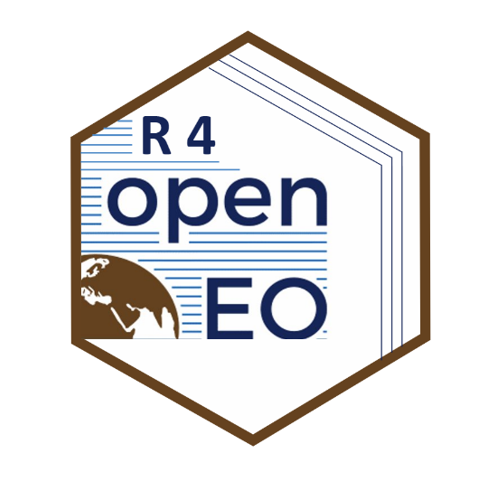

openeo: Client Interface for openEO Servers
====
<!-- badges: start -->
[](https://github.com/Open-EO/openeo-r-client/actions)
<!-- badges: end -->


<hr>
# openEO

The core [concept of "openEO"](https://openeo.org/about.html) is related to Big Data processing strategies. Earth Observation data (EO data) is becoming more and more available by different space missions, like Landsat and Sentinel, and the data produced is too large to be processed locally anymore. "openEO" defines an unified API for back-end and client software and also number of common processes for manipulating spatio-temporal data cubes. The basic idea is to divide computation (back-end server) and workflow definition (client software).
As back-ends there are some still around, which were developed in the main [openEO](https://openeo.org/) project and improved by new once by the ESA project [openEO Platform](https://openeo.cloud/). Those back-ends offer access to their data collections and processing platform. And the various client software (R, Python, JavaScript, QGIS) help creating processing workflows in a programming environment that is familiar to the user.

## openEO client in R

This R package contains functions and classes that allow interactions with openEO back-end server. The main goals of this package are:
* enable R user to explore openEO back-ends in terms of data and operations
* aid R user to create processing workflows on Earth Observation data that can be executed on openEO back-ends
* retrieve results for further analysis in R

# Installation

The most recent code is located on Github. To install it, you can use the following code:
```
if (!require(devtools)) {
  install.packages("devtools",dependencies=TRUE)
  library(devtools)
}
install_github(repo="Open-EO/openeo-r-client",dependencies=TRUE)
library(openeo)
```

Otherwise, once it is accepted by CRAN you can install the latest stable version by:

```
install.packages("openeo")
library(openeo)

```

If you want use a different version, then use for the parameter `ref` either "master", "develop" or another version specified under [releases](https://github.com/Open-EO/openeo-r-client/releases).

Currently the package complies to the major openEO API version 1.0.x. It is also possible to manually install older versions that comply to the API version 0.4.2. But this is not recommended, because there are probably no back-ends available anymore that support this old version. The old versions are simply stated here for historic reasons. Starting with the stable API version 1.0.0 the package will be backward compatible within the semantic versioning.

| openeo R client version | openEO API version | openEO API status |
| --- | --- | --- |
| not yet | [v1.1.x](https://openeo.org/documentation/1.0/developers/api/reference.html) | stable |
| v1.0.x | [v1.0.x](https://openeo.org/documentation/1.0/developers/api/reference.html) | stable |
| v0.6.x | [v0.4.2](https://openeo.org/documentation/0.4/developers/api/reference.html) | deprecated |
| v0.5.x | [v0.4.2](https://openeo.org/documentation/0.4/developers/api/reference.html) | deprecated |
| v0.4.x | [v0.4.2](https://openeo.org/documentation/0.4/developers/api/reference.html) | deprecated |

# Prerequirements

The 'openeo' package won't process anything at the local machine. It will always interact with a designated back-end. Only at the back-end the data is stored and the computations are performed. Therefore please make sure you are registered with any of the available openEO back-ends, in order to obtain credentials and the access URLs (see: [openEO Hub](https://hub.openeo.org/) for getting an overview about available back-ends). 

# Getting Started
After installing and loading the package, you need to connect to the openEO back-end you want to use. The object that is returned by the `connect` function is essential for the interaction with this particular back-end. Users can then explore the data and processes and start creating a processing workflows, free of charge. To start processing data or publishing web services, however, the user needs to be registered and authenticated with the openEO back-end provider. The provider offers different execution plans, e.g. free-of-charge or other pricing concepts, from which the user can chose.

Example back-end provider:
* https://earthengine.openeo.org
* https://openeo.vito.be
* https://openeo.cloud

The Google Earth Engine (GEE) interface for openEO is not actively maintained, but for testing and PR there are credentials stated under the demo section at the [openEO GEE Github repository](https://github.com/Open-EO/openeo-earthengine-driver). Please bear in mind, that the access is free, but Google might revoke the rights if the processing load is too high. So use it only for playing around with the different openEO clients and not for productive purposes. "openeo.cloud" is the link to ESAs ["openEO Platform" project](https://openeo.cloud/), for which you have to be [signed up via EGI and openEO platform](https://docs.openeo.cloud/authentication/#join-openeo-platform).

In the following there is a code sample, how to create a processing workflow that calculates the minimum NDVI of a spatial and temporal subset on Sentinel-2 data and perform a linear scaling to store the results as PNG file. 

```
library(openeo)
connect(host="https://earthengine.openeo.org")

# list collection and processes
colls = list_collections()
list_processes()

# get detailed descriptions
describe_collection("COPERNICUS/S2")
describe_process("load_collection")

# create a process graph / task
p = processes()

data = p$load_collection(id = colls$`COPERNICUS/S2`,
                             spatial_extent = list(
                               west=16.1,
                               east=16.6,
                               north=48.6,
                               south= 47.2
                             ),
                             temporal_extent = list(
                               "2018-04-01", "2018-05-01"
                             ),
                             bands=list("B8","B4")))

spectral_reduce = p$reduce_dimension(data = data, dimension = "bands",reducer = function(data,context) {
  B08 = data[1]
  B04 = data[2]
  return((B08-B04)/(B08+B04))
})

temporal_reduce = p$reduce_dimension(data=spectral_reduce,dimension = "t", reducer = function(x,y){
  p$min(x)
})

apply_linear_transform = p$apply(data=temporal_reduce,process = function(value,...) {
  p$linear_scale_range(x = value, 
                           inputMin = -1, 
                           inputMax = 1, 
                           outputMin = 0, 
                           outputMax = 255)
})

result = p$save_result(data=apply_linear_transform,format="PNG")
```

At this point you would need to log in (at latest) with your personal credentials for further computations.

```                                
login(user="",password="")
job_id = create_job(graph=result, title="Example graph", description="This graph is just a general example",format="png")

start_job(job_id)

result_obj = list_results(job_id)

download_results(job = job_id, folder = ".")

```

To get an overview which functions the packages offers and to access the function documentation you can either navigate in RStudio into the "Packages" tab and select the "openeo" package and click on the function you are interested in. Or you can use the following command line operations:

```R
library(help="openeo")

# ?<function_name>, e.g.
?connect
```

# Additional Examples
If you are interested, you can have a look at some example scripts that were used during the Proof-of-Concept under [examples](https://github.com/Open-EO/openeo-r-client/tree/master/examples) to get a feeling, how to use the package. Some of the scripts are outdated and will be replaced in the future.

# Further Information
The [Wiki](https://github.com/Open-EO/openeo-r-client/wiki) contains also additional information on process graph building and other topics.

# Funding
The authors acknowledge the financial support for the development of this package during the H2020 project "openEO" (Oct 2017 to Sept 2020) by the European Union, funded by call EO-2-2017: EO Big Data Shift, under grant number 776242. We also acknowledge the financial support received from ESA for the project "R4openEO" (Sept 2021 to Sept 2022). 

Furthermore, openEO was improved and operationalized by ESA funding in the project "openEO Platform" (Sept 2020 to Sept 2022).

# Links
* [openEO.org](https://openeo.org/)
* [openEO core API](https://openeo.org/documentation/1.0/developers/api/reference.html)
* [openEO hub](https://hub.openeo.org/)
* [openEO R Client package API](https://open-eo.github.io/openeo-r-client/)
