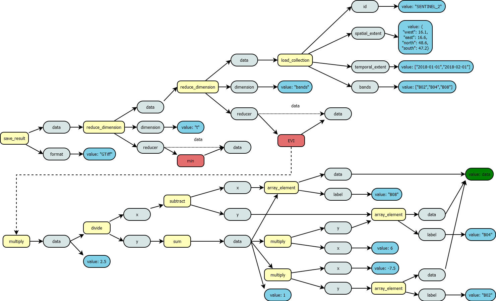

In this guide you will familiarize yourself with the concepts of the process graph building in the `openeo` package with respect to the [openEO API](https://api.openeo.org/#section/Processes) and [openEO processes](https://processes.openeo.org/) from a user perspective. In the following we will briefly state the logical structure of an openEO process description and how process graphs are created from processes. Afterwards we dive into some detail about the parameters and arguments of processes, especially how this relates to R where function parameters are usually type free.

Note: For demonstration purposes we will use the general definitions of the *openEO processes* and their descriptions in order to make them easier to understand.

# Concepts

The main idea in openEO is that back-ends provide spatio-temporal data collections, a set of processes specifying how the data shall be manipulated as well as the computing power to process the data accordingly. The data in general is abstracted to be an n-dimensional data cube, more often the used dimensions are spatial (x,y), temporal (t) and there are different bands which denote sensory properties in a categorical way, e.g. a specific wavelength interval for optical measurements or the kind of polarization used in SAR measurements.

## Processes

The openEO API defines processes in a general way, meaning that to be conformant to the API back-ends do not need to implement the whole set of openEO processes, which can be considered to be a set of Good-Practice functions that cover almost all relevant operations on n-dimensional spatio-temporal data. As for this package it means that the "tools" are dependent on the connected back-end and they have to be interpreted dynamically after the connection has been established. The openEO API defines how processes information has to be structured to be interpreted by this package and the openEO processes suggest a set of processes with descriptions and parameters, but the back-end is not obliged to implement or provide any of them. They might even change parameter types or the naming all together.

What remains of it is that all the openEO processes are described in the way the openEO API defines processes.

Now we also need to distinguish between predefined and user-defined processes. The predefined processes are those that are already provided by the back-end and which are implanted ready to be used for processing. The user-defined processes are those process graphs a user can create out of the predefined processes. There we can also define variables to allow for a parametrization, which more or less works like placeholders in the graph that will be filled upon use. This user defined processes can be stored on the back-end `create_user_process()`, which are then only available for the user that have created that processes. Similarly to the initialization of the predefined processes with `processes()`, the users own processes can be loaded by `user_processes()`. The user defined processes can then also be used as building blocks, hiding more complex functions.

```{r, evi_example, eval=FALSE}
library(openeo)
# EVI example to create a user-defined processes
con = connect("openeo.cloud")

p = processes()

evi_function = function(x,context) {
  b02 = x[1]
  b04 = x[2]
  b08 = x[3]
  
  2.5*((b08-b04)/sum(b08,6*b04,-7.5*b02,1))
}

login()

evi_process = create_user_process(evi_function,id = "evi",summary = "Function to be used in a band reducing function with an array of three input values as B02,B04 and B08 of a Sentinel-2 data set.")
evi_process
```

## Process Graph and Process Node

We have established that user-defined processes and process graphs are the same. By combining the processes, we will create a graph structure. And as graphs consist of nodes, we refer to a process that has been used in a process graph as Process Node. With "used" we mean that the processes parameters have been bound with values. By using a Process Node as input parameter, we create the relations between the Process Nodes and hence the process graph.

```{r, eval=FALSE}
library(openeo)
con = connect("openeo.cloud")
p = processes()
coll = list_collections()

data = p$load_collection(id = coll$SENTINEL2_L2A_SENTINELHUB, bands = c("B02","B04","B08"))
class(data)
```

The return value is a `ProcessNode` that is create from the `Process` as a template during the call of the respective function. Conceptually the `ProcessNode` is a `Process` that is extended with the field "nodeId", which is used to reference this particular step in the graph. Other then that the creation of a `ProcessNode` via the respective function at the `ProcessCollection` creates a new R6 object with its own [`Argument`]. T

Usually, the return values of processes that can be used for relation building is again a n-dimensional data cube (either raster or vector cubes). But there are also processes that either return arrays or single values. Those processes can by itself create also a process graph. They are used in process graph definitions for subroutines like band arithmetic operations, mask creation or aggregation functions.

```{r, eval = FALSE}
library(openeo)
con = connect("openeo.cloud")
p = processes()
coll = list_collections()

# as starting point: process(argument[s]) --> data
data = p$load_collection(id = coll$SENTINEL2_L2A_SENTINELHUB,temporal_extent = c("2021-05-01","2021-08-31"), band = c("B04","B08"))

# as modifier: process(data, argument[s]) --> data
temporal_subset = p$filter_temporal(data = data, extent=c("2021-05-01","2021-08-31"))

# as modifier with process graph: process(data, arguments, process) --> data
ndvi_data = p$reduce_dimension(data=temporal_subset,dimension=c("t"),reducer = function(x, ...) {
  b04 = x[1]
  b08 = x[2]
  
  (b08-b04)/(b08+b04)
})

# scalar processes
p$add(x=2,y=4) # usually used in the former R syntax to manipulate data arrays

# as save / serializer: process(data, argument[s]) --> void
result = p$save_result(data=ndvi_data, format = "GTiff")
```

The openEO processes define some data loading functions, like `load_collection`, which define starting points in a process graph that is going to be executed to create a result. For the processing at the backend those processes denote points where actual data is loaded into the processing chain. On the other side `save_result` marks point where data is serialized, which is usually the end of the process graph and contains the data a user wants to obtain as an end result. The following examples shows a process graph that will calculate the minimum value of Enhanced Vegetation Index (EVI) for a data subset. First a data collection was chosen with `load_collection` and a spatial, temporal and band constraint was applied, which limits the data collection to a specific spatial subset for the given time interval and it also selects the three bands B02, B04 and B08. Then two reduce_dimension operations are performed. The first enables a band arithmetic operation by reducing the bands, which will mean that a reducer function will be applied on each of the remaining cells in x, y and t. This means that the data input of this reducer function will be an array of the measurement values for each band, e.g. [7000,4000,5000] with the order specified in the `load_collection` function for parameter "band". The used EVI function was ideally created beforehand and was stored as a user-defined process on the back-end. Then we reduced over the time dimension t, be selecting the minimum in this time period. The input for the minimum aggregation will be again a vector, but this time it already contains the EVI values from the previous step, e.g. [0.3246, 0.3021, 0.2345, 0.1231, 0.3456, 0.4367, 0.6753] where the value corresponds to the recording time of the scene and a natural time order is assumed. The final step stores the result as a GTiff file, which marks also the end of processing.



The seed of the graph structure is a single `ProcessNode` that is not used by another `ProcessNode` of the graph, this is called the final node. A `ProcessNode` consists of the id of an openEO process, user-defined values for its parameters, as well as a unique id of the `ProcessNode` itself. The graph is simply a set of `ProcessNode`s which are connected to at least one other `ProcessNode`. We distinguish between the nodes definition and its use by reference. This affects how it is represented (serialized) in the JSON representation of the graph. A reference is serialized as a reference object in JSON like `{"from_node":"some_node_id"}`. Otherwise the `ProcessNode` is defined in a schematic way like:

    Graph := {
      "nodeId1": <Process>,
      "nodeId2": <Process>
    }

    Process := {
      "process_id": <ProcessName>
      "arguments": {
        "parameterName1": <Argument>,
        "parameterName2": <Argument>
      }
    }

    Argument := Value|NodeReference

    NodeReference := {
      "from_node":"nodeId2"
    }

The transformation of the `ProcessNode` into a JSON graph is called serialization. This is done by traversing bottom-up through the graph starting at the final node. Each user-defined parameter of the visited `ProcessNode` is checked if it is a simple value or another `ProcessNode`. Each of the newly found `ProcessNode`s is visited in the next step and its arguments are scanned also until there are no new `ProcessNode`s left. Where a process node was found a reference object will be created, other arguments reflect their value.

The user defined process, which we have defined before (EVI) would look like this:

    {
      "array_element_CRUBQ5502B": {
        "process_id": "array_element",
        "arguments": {
          "data": {
            "from_parameter": "x"
          },
          "index": 2,
          "return_nodata": false
        }
      },
      "array_element_HKVTL6105G": {
        "process_id": "array_element",
        "arguments": {
          "data": {
            "from_parameter": "x"
          },
          "index": 1,
          "return_nodata": false
        }
      },
      "subtract_THEWN7421S": {
        "process_id": "subtract",
        "arguments": {
          "x": {
            "from_node": "array_element_CRUBQ5502B"
          },
          "y": {
            "from_node": "array_element_HKVTL6105G"
          }
        }
      },
      "multiply_HFOGI6385B": {
        "process_id": "multiply",
        "arguments": {
          "x": 6,
          "y": {
            "from_node": "array_element_HKVTL6105G"
          }
        }
      },
      "array_element_JCXIO4829E": {
        "process_id": "array_element",
        "arguments": {
          "data": {
            "from_parameter": "x"
          },
          "index": 0,
          "return_nodata": false
        }
      },
      "multiply_CEOJU9730W": {
        "process_id": "multiply",
        "arguments": {
          "x": -7.5,
          "y": {
            "from_node": "array_element_JCXIO4829E"
          }
        }
      },
      "sum_TSXJU2112N": {
        "process_id": "sum",
        "arguments": {
          "data": [
            {
              "from_node": "array_element_CRUBQ5502B"
            },
            {
              "from_node": "multiply_HFOGI6385B"
            },
            {
              "from_node": "multiply_CEOJU9730W"
            },
            1
          ],
          "ignore_nodata": false
        }
      },
      "divide_KYDNA4078A": {
        "process_id": "divide",
        "arguments": {
          "x": {
            "from_node": "subtract_THEWN7421S"
          },
          "y": {
            "from_node": "sum_TSXJU2112N"
          }
        }
      },
      "multiply_HIVAA9923I": {
        "process_id": "multiply",
        "arguments": {
          "x": 2.5,
          "y": {
            "from_node": "divide_KYDNA4078A"
          }
        },
        "result": true
      }
    } 

The single "load_collection" process node would look like this:

    {
      "process_id": "load_collection",
      "arguments": {
        "id": "SENTINEL2_L2A_SENTINELHUB",
        "temporal_extent": [
          "2021-05-01",
          "2021-08-31"
        ],
        "bands": [
          "B04",
          "B08"
        ]
      }
    }

and as Process:

    {
      "process_graph": {
        "load_collection_XGXUY9528Y": {
          "process_id": "load_collection",
          "arguments": {
            "id": "SENTINEL2_L2A_SENTINELHUB",
            "temporal_extent": [
              "2021-05-01",
              "2021-08-31"
            ],
            "bands": [
              "B04",
              "B08"
            ]
          },
          "result": true
        }
      },
      "parameters": [],
      "returns": {
        "schema": {
          "type": "object",
          "subtype": "raster-cube"
        }
      }
    } 

## Arguments and Parameters

```{r, include=FALSE}
openeo:::demo_processes()
```

All the processes offer various kinds of parameters so the user can control the process. One parameter, usually "data", transports the input data that will be manipulated. If the parameter type is a raster or vector cube the whole n-dimensional data cube will be manipulated. But it is also possible to manipulate arrays or scalars of data. This kind of input is often times transferred to the process, when a process graph is allowed as value for the parameter. The user-defined process that is passed to that parameter needs to accept the parameters provided "process graph parameters" as input.

The other controlling parameters can have a [variety of types](https://github.com/Open-EO/openeo-processes/blob/master/meta/subtype-schemas.json).

To clarify, the parameter type matching is completely hidden from the user. A user simply tries to pass a value to a process parameter and the most suitable allowed parameter type is chosen automatically. If the value cannot be matched to the allowed types for the parameter, then at some point a warning or an error will be raised. To inform yourself about the allowed parameter types, please look up the process descriptions.

```{r}
describe_process("load_collection")
```


### Parameter manipulation

In order to set the values for the parameters of the processes you can use the builder functions of the `ProcessCollection`, where you can pass arguments as the function parameters.

```{r}
library(sf)
p = processes()

bbox = st_bbox(c(xmin=7,xmax=7.5,ymin=52,ymax=52.5))
st_crs(bbox) = 4326

dc = p$load_collection(id = "S2", spatial_extent = bbox,temporal_extent = list("2022-05-20","2022-06-10"))
dc
```

As a second option you can manipulate the parameters of the process node by interacting with the field `parameters` of `ProcessNode`.

```{r}
dc$parameters$bands = c("B04","B08")
dc
```

The values can also replace existing values, in the same way.

```{r}
dc$parameters$temporal_extent = c("2022-05-01",NA)
dc
```

Of course, you can simply return the current value for a parameter as well.

```{r}
dc$parameters$spatial_extent
```

### Variables

Another useful function is the concept of variables. Those are considered to be placeholder for certain arguments. 

```{r}
bbox_var = create_variable(name="bbox",description = "The bounding box of the process graph")

dc$parameters$spatial_extent = bbox_var
dc
```

When creating parameterized user-defined processes the variables are used as the functions input parameter.

```{r}
ndvi_prep_loader = as(dc,"Process")
ndvi_prep_loader
```

